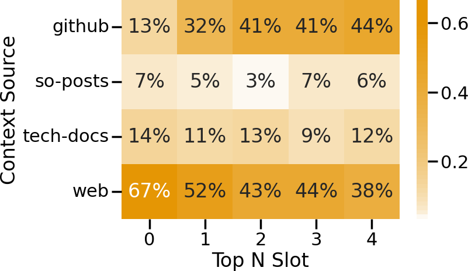
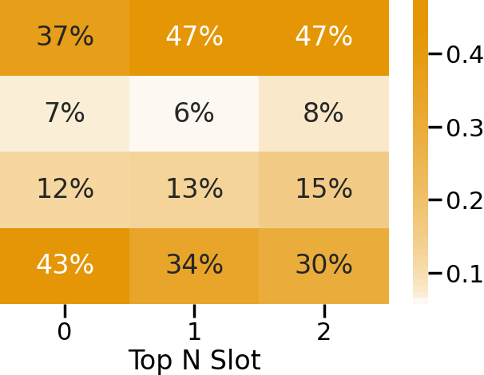
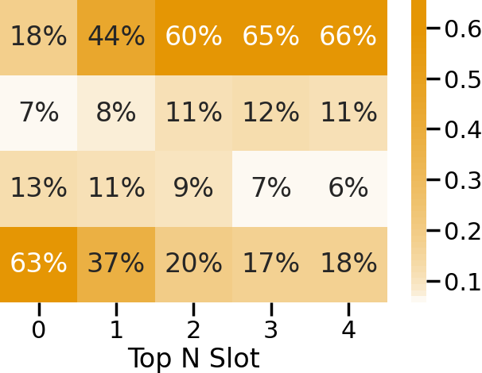
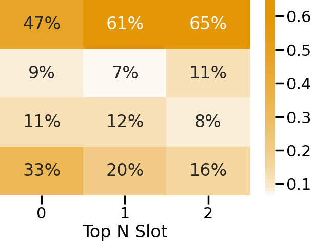
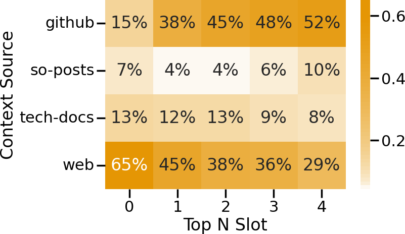
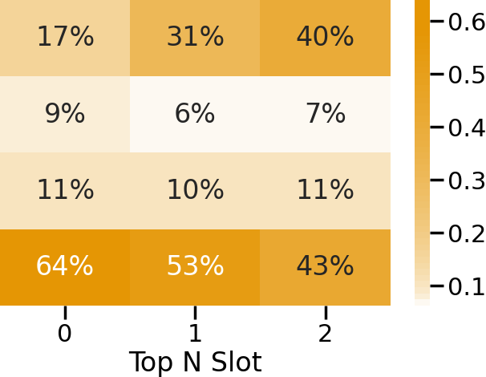
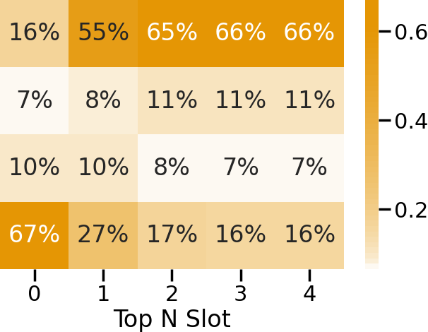
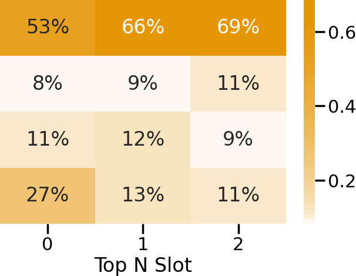

Artifact release for the paper: "On Automating Configuration Dependency Validation via Retrieval-Augmented Generation"

## Paper
PDF: will be linked later

## ABSTRACT</h3>

Configuration dependencies arise when multiple technologies in a software system require coordinated settings for correct interplay. Existing approaches for detecting such dependencies often yield high false-positive rates, require additional validation mechanisms, and are typically limited to specific projects or technologies. Recent work that incorporates large language models (LLMs) for dependency validation still suffers from inaccuracies due to project- and technology-specific variations, as well as from missing contextual information. 

In this work, we propose to use retrieval-augmented generation (RAG) systems for configuration dependency validation, which allows us to incorporate  additional project- and technology-specific context information. Specifically, we evaluate whether RAG can improve LLM-based validation of configuration dependencies and what contextual information are needed to overcome the static knowledge base of LLMs. To this end, we conducted a large empirical study on validating configuration dependencies using RAG. Our evaluation shows that vanilla LLMs already demonstrate solid validation abilities, while RAG has only marginal or even negative effects on the validation performance of the models. By incorporating tailored contextual information into the RAG system--derived from a qualitative analysis of validation failures--we achieve significantly more accurate validation results across all models, with an average precision of 0.84 and recall of 0.70, representing improvements of 35% and 133% over vanilla LLMs, respectively. In addition, these results offer two important insights: Simplistic RAG systems may not benefit from additional information if it is not tailored to the task at hand, and it is often unclear upfront what kind of information yields improved performance.

## Project Structure

- `/config`: contains the configuration files for the different RAG variants and for ingestion
- `/data`: contains data of subject systems, dependency datasets, ingested data, and evaluation results 
- `/evaluation`: contains script for evaluation
- `/src`: contains implementation of the RAG system

## Supported Models

<details>
<table>
  <thead>
    <tr>
      <th>Alias</th>
      <th>Model Name</th>
      <th># Params</th>
      <th>Context Length</th>
      <th>Open Source</th>
    </tr>
  </thead>
  <tbody>
    <tr>
      <td>4o</td>
      <td>gpt-4o-2024-11-20</td>
      <td style="text-align: right;">-</td>
      <td style="text-align: right;">128k</td>
      <td style="text-align: right;">no</td>
    </tr>
    <tr>
      <td>4o-mini</td>
      <td>gpt-4o-mini-2024-07-18</td>
      <td style="text-align: right;">-</td>
      <td style="text-align: right;">128k</td>
      <td style="text-align: right;">no</td>
    </tr>
    <tr>
      <td>DSr:70b</td>
      <td>deepseek-r1:70b</td>
      <td style="text-align: right;">70B</td>
      <td style="text-align: right;">131k</td>
      <td style="text-align: right;">yes</td>
    </tr>
    <tr>
      <td>DSr:14b</td>
      <td>deepseek-r1:14b</td>
      <td style="text-align: right;">14B</td>
      <td style="text-align: right;">131k</td>
      <td style="text-align: right;">yes</td>
    </tr>
    <tr>
      <td>L3.1:70b</td>
      <td>llama3.1:70b</td>
      <td style="text-align: right;">70B</td>
      <td style="text-align: right;">8k</td>
      <td style="text-align: right;">yes</td>
    </tr>
    <tr>
      <td>L3.1:8b</td>
      <td>llama3.1:8b</td>
      <td style="text-align: right;">8B</td>
      <td style="text-align: right;">8k</td>
      <td style="text-align: right;">yes</td>
    </tr>
  </tbody>
</table>
</details>
</details>

## Supported RAG Variants

<details>

<table>
  <thead>
    <tr>
      <th>ID</th>
      <th>Embedding Model</th>
      <th>Embedding Dimension</th>
      <th>Reranking</th>
      <th>Top N</th>
    </tr>
  </thead>
  <tbody>
    <tr>
      <td>R1</td>
      <td>text-embed-ada-002</td>
      <td style="text-align: right;">1536</td>
      <td style="text-align: right;">Sentence Transformer</td>
      <td style="text-align: right;">5</td>
    </tr>
    <tr>
      <td>R2</td>
      <td>text-embed-ada-002</td>
      <td style="text-align: right;">1536</td>
      <td style="text-align: right;">Sentence Transformer</td>
      <td style="text-align: right;">3</td>
    </tr>
    <tr>
      <td>R3</td>
      <td>text-embed-ada-002</td>
      <td style="text-align: right;">1536</td>
      <td style="text-align: right;">Colbert Rerank</td>
      <td style="text-align: right;">5</td>
    </tr>
    <tr>
      <td>R4</td>
      <td>text-embed-ada-002</td>
      <td style="text-align: right;">1536</td>
      <td style="text-align: right;">Colbert Rerank</td>
      <td style="text-align: right;">3</td>
    </tr>
    <tr>
      <td>R5</td>
      <td>gte-Qwen2-7B-instruct</td>
      <td style="text-align: right;">3584</td>
      <td style="text-align: right;">Sentence Transformer</td>
      <td style="text-align: right;">5</td>
    </tr>
    <tr>
      <td>R6</td>
      <td>gte-Qwen2-7B-instruct</td>
      <td style="text-align: right;">3584</td>
      <td style="text-align: right;">Sentence Transformer</td>
      <td style="text-align: right;">3</td>
    </tr>
    <tr>
      <td>R7</td>
      <td>gte-Qwen2-7B-instruct</td>
      <td style="text-align: right;">3584</td>
      <td style="text-align: right;">Colbert Rerank</td>
      <td style="text-align: right;">5</td>
    </tr>
    <tr>
      <td>R8</td>
      <td>gte-Qwen2-7B-instruct</td>
      <td style="text-align: right;">3584</td>
      <td style="text-align: right;">Colbert Rerank</td>
      <td style="text-align: right;">3</td>
    </tr>
  </tbody>
</table>
</details>

## Experiments

<details>
To run the experiments on the validation effectiveness of vanilla LLMs and different RAG variants, you need to execute the ingestion once and the retrieval, and generation pipeline one after the other for a given RAG variant. Next, we describe the different steps in detail:

1. Create a ``.env`` file in the root directory containing the API token for OpenAI, Pinecone, and GitHub.

    ```
    OPENAI_KEY=<your-openai-key>
    PINECONE_API_KEY=<your-pinecone-key>
    GITHUB_TOKEN=<your-github-key>   
    ```

2. Run the ingestion pipeline once to create the specific Pinecone indices for the static and dynamic context information and already ingest the static context using the following command:

    ```python
    python ingestion_pipeline.py
    ```
    
    By default, this script uses the `.env` file in the root directory and the `ingestion.toml` in the configs directory, but they can be changed using the the corresponding command line argumengts `--config_file` and `--env_file`. The `ingestion.toml` specifies the static and dynamic indices according to the underlying embedding models and their embedding models as well as the sources of the static context, which is directly ingested after the creation of the static indices. 

3. Once the vector database is set up properly, we can start the retrieval pipeline for a given RAG variants using the following command:

    ```python
    python retrieval_pipeline.py --config_file=configs/config_{ID}.toml
    ```

    The `config_{ID}.toml` defines a specific RAG variant. The RAG variants have the IDs from 1 to 8 (R1-R8), while vanille LLMs have the ID 0. Each configuration file for a RAG variant contains the following parameters:
     - `index_name`: the index from which data should be retrieved
     - `embedding_model`: the embedding model
     - `embedding_dimension`: the dimension of the embedding model
     - `rerank`: the re-ranking algorithm
     - `top_n`: the number of chunk provided to the LLM
     - `num_websited`: number of websites to get dynamic context
     - `alpha`: the weight for sparse/dense retrieval
     - `web_search_enabled`: defined whether Web search is enabled or not
     - `inference_models`: list of LLMs for generation
     - `temperature`: temperature of LLMs
     - `data_file`: path of data file containing the dependencies for validation
     - `retrieval_file`: path of data file in which the retrieval results should be stored
     - `generation_file`: path of data file in which the generation results should be stores.
     

    This script iterates through all dependencies, retrieves static and dynamic context, and finally stores the retrieval results.


4.  Once the additional context is retrieved, we can run the generation pipeline with the following command:
    
    ```python
        python generation_pipeline.py --config_file=configs/config_{ID}.toml
    ```

    This script takes as input the same configuration file that we use for running the retrieval pipeline. For each inference model specified, it iterates through all dependencies, validates them with the additional context, and finally stores the generation results.


5. To run the retrieval and generation for the refined vanilla LLMs and refined RAG variant, execute step 2 and 3 with the corresponding configuration file: `configs/advanced_{ID}`, where ID can either be 0 for refined vanille LLMs or 1 for refined RAG variant R1.


6. To compute the validation effectiveness of a vanilla LLMs or a specific RAG variant switch to the `evaluation` directory and execute the following command:
    
    ```python
    python metrics.py --genration_file={generation_file}.json
    ```

</details>


## Results

### RQ1.1: Validation Effectiveness of Vanilla LLMs and RAG Variants
The following tables show the validation effectiveness of vanilla LLMs (w/o) and all RAG variants (R1-R8) on a dataset of 350 real-world cross-technology configuration dependencies.


<details>
  <summary><strong>Precision</strong></summary>

  <table>
    <thead>
      <tr>
        <th>Model</th><th>w/o</th><th>R1</th><th>R2</th><th>R3</th><th>R4</th><th>R5</th><th>R6</th><th>R7</th><th>R8</th>
      </tr>
    </thead>
    <tbody>
      <tr><td>4o</td><td>0.89</td><td>0.86</td><td>0.84</td><td>0.83</td><td>0.85</td><td>0.82</td><td>0.79</td><td>0.83</td><td>0.86</td></tr>
      <tr><td>4o-mini</td><td>0.76</td><td>0.60</td><td>0.59</td><td>0.53</td><td>0.56</td><td>0.54</td><td>0.62</td><td>0.55</td><td>0.58</td></tr>
      <tr><td>DSr:70B</td><td>0.76</td><td>0.74</td><td>0.63</td><td>0.66</td><td>0.67</td><td>0.63</td><td>0.65</td><td>0.69</td><td>0.68</td></tr>
      <tr><td>DSr:14B</td><td>0.84</td><td>0.66</td><td>0.70</td><td>0.61</td><td>0.74</td><td>0.68</td><td>0.70</td><td>0.66</td><td>0.69</td></tr>
      <tr><td>L3.1:70b</td><td>0.70</td><td>0.65</td><td>0.67</td><td>0.65</td><td>0.60</td><td>0.53</td><td>0.62</td><td>0.58</td><td>0.66</td></tr>
      <tr><td>L3.1:8b</td><td>0.52</td><td>0.53</td><td>0.50</td><td>0.56</td><td>0.54</td><td>0.54</td><td>0.51</td><td>0.58</td><td>0.47</td></tr>
      <tr><td><strong>Mean</strong></td><td><strong>0.75</strong></td><td>0.67</td><td>0.65</td><td>0.64</td><td>0.66</td><td>0.62</td><td>0.65</td><td>0.65</td><td>0.66</td></tr>
      <tr><td><strong>Best</strong></td><td><strong>0.89</strong></td><td>0.86</td><td>0.84</td><td>0.83</td><td>0.85</td><td>0.82</td><td>0.79</td><td>0.83</td><td>0.86</td></tr>
    </tbody>
  </table>
</details>

<details>
  <summary><strong>Recall</strong></summary>

  <table>
    <thead>
      <tr>
        <th>Model</th><th>w/o</th><th>R1</th><th>R2</th><th>R3</th><th>R4</th><th>R5</th><th>R6</th><th>R7</th><th>R8</th>
      </tr>
    </thead>
    <tbody>
      <tr><td>4o</td><td>0.46</td><td>0.61</td><td>0.62</td><td>0.56</td><td>0.59</td><td>0.61</td><td>0.56</td><td>0.56</td><td>0.60</td></tr>
      <tr><td>4o-mini</td><td>0.18</td><td>0.78</td><td>0.76</td><td>0.62</td><td>0.74</td><td>0.67</td><td>0.71</td><td>0.64</td><td>0.73</td></tr>
      <tr><td>DSr:70B</td><td>0.59</td><td>0.73</td><td>0.51</td><td>0.64</td><td>0.52</td><td>0.59</td><td>0.62</td><td>0.65</td><td>0.58</td></tr>
      <tr><td>DSr:14B</td><td>0.56</td><td>0.46</td><td>0.45</td><td>0.44</td><td>0.42</td><td>0.56</td><td>0.41</td><td>0.51</td><td>0.39</td></tr>
      <tr><td>L3.1:70b</td><td>0.45</td><td>0.34</td><td>0.36</td><td>0.24</td><td>0.23</td><td>0.26</td><td>0.35</td><td>0.24</td><td>0.30</td></tr>
      <tr><td>L3.1:8b</td><td>0.52</td><td>0.34</td><td>0.29</td><td>0.33</td><td>0.32</td><td>0.33</td><td>0.41</td><td>0.34</td><td>0.33</td></tr>
      <tr><td><strong>Mean</strong></td><td>0.46</td><td><strong>0.54</strong></td><td>0.50</td><td>0.47</td><td>0.47</td><td>0.50</td><td>0.51</td><td>0.49</td><td>0.49</td></tr>
      <tr><td><strong>Best</strong></td><td>0.59</td><td><strong>0.78</strong></td><td>0.76</td><td>0.64</td><td>0.74</td><td>0.67</td><td>0.71</td><td>0.65</td><td>0.73</td></tr>
    </tbody>
  </table>
</details>

<details>
  <summary><strong>F1-Score</strong></summary>

  <table>
    <thead>
      <tr>
        <th>Model</th><th>w/o</th><th>R1</th><th>R2</th><th>R3</th><th>R4</th><th>R5</th><th>R6</th><th>R7</th><th>R8</th>
      </tr>
    </thead>
    <tbody>
      <tr><td>4o</td><td>0.61</td><td>0.71</td><td>0.71</td><td>0.67</td><td>0.70</td><td>0.70</td><td>0.65</td><td>0.67</td><td>0.71</td></tr>
      <tr><td>4o-mini</td><td>0.29</td><td>0.68</td><td>0.66</td><td>0.57</td><td>0.64</td><td>0.60</td><td>0.66</td><td>0.59</td><td>0.65</td></tr>
      <tr><td>DSr:70B</td><td>0.66</td><td>0.74</td><td>0.56</td><td>0.65</td><td>0.59</td><td>0.61</td><td>0.63</td><td>0.67</td><td>0.62</td></tr>
      <tr><td>DSr:14B</td><td>0.67</td><td>0.54</td><td>0.55</td><td>0.51</td><td>0.54</td><td>0.62</td><td>0.51</td><td>0.57</td><td>0.50</td></tr>
      <tr><td>L3.1:70b</td><td>0.55</td><td>0.45</td><td>0.47</td><td>0.35</td><td>0.34</td><td>0.35</td><td>0.44</td><td>0.34</td><td>0.41</td></tr>
      <tr><td>L3.1:8b</td><td>0.52</td><td>0.41</td><td>0.37</td><td>0.42</td><td>0.40</td><td>0.41</td><td>0.46</td><td>0.43</td><td>0.39</td></tr>
      <tr><td><strong>Mean</strong></td><td>0.55</td><td><strong>0.59</strong></td><td>0.55</td><td>0.53</td><td>0.53</td><td>0.55</td><td>0.56</td><td>0.55</td><td>0.55</td></tr>
      <tr><td><strong>Best</strong></td><td>0.67</td><td><strong>0.74</strong></td><td>0.71</td><td>0.67</td><td>0.70</td><td>0.70</td><td>0.66</td><td>0.67</td><td>0.71</td></tr>
    </tbody>
  </table>
</details>


### RQ1.2: Retrieved Contextual Information
The following figures show the fraction of sources that the RAG variants have deemed relevant for the query and submitted to one of the three or five context slots depending on the RAG variant. We also the show average relevance score for each context slot across all RAG variants

<details>
  <summary><strong>Context Source Usage per RAG Variant</strong></summary>

  <!-- Row 1 -->
  <div style="display: flex; flex-wrap: wrap; gap: 10px; justify-content: space-around;">
    <div style="flex: 1 1 22%; text-align: center;">
      
      <div><small>R1</small></div>
    </div>
    <div style="flex: 1 1 17%; text-align: center;">
      
      <div><small>R2</small></div>
    </div>
    <div style="flex: 1 1 17%; text-align: center;">
      
      <div><small>R3</small></div>
    </div>
    <div style="flex: 1 1 17%; text-align: center;">
      
      <div><small>R4</small></div>
    </div>
  </div>

  <!-- Spacer -->
  <br/>

  <!-- Row 2 -->
  <div style="display: flex; flex-wrap: wrap; gap: 10px; justify-content: space-around;">
    <div style="flex: 1 1 22%; text-align: center;">
      
      <div><small>R5</small></div>
    </div>
    <div style="flex: 1 1 17%; text-align: center;">
      
      <div><small>R6</small></div>
    </div>
    <div style="flex: 1 1 17%; text-align: center;">
      
      <div><small>R7</small></div>
    </div>
    <div style="flex: 1 1 17%; text-align: center;">
      
      <div><small>R8</small></div>
    </div>
  </div>
</details>

<details>
  <summary><strong>Average Relevance Score per Context Slot</strong></summary>

  <table>
    <thead>
      <tr>
        <th>Context Slot</th>
        <th>R1</th>
        <th>R2</th>
        <th>R3</th>
        <th>R4</th>
        <th>R5</th>
        <th>R6</th>
        <th>R7</th>
        <th>R8</th>
      </tr>
    </thead>
    <tbody>
      <tr><td>1</td><td>-2.93</td><td>-5.05</td><td>0.70</td><td>0.68</td><td>-2.53</td><td>-3.10</td><td>0.70</td><td>0.68</td></tr>
      <tr><td>2</td><td>-5.73</td><td>-6.65</td><td>0.67</td><td>0.66</td><td>-5.63</td><td>-5.10</td><td>0.66</td><td>0.66</td></tr>
      <tr><td>3</td><td>-6.67</td><td>-7.31</td><td>0.66</td><td>0.65</td><td>-6.51</td><td>-6.51</td><td>0.65</td><td>0.65</td></tr>
      <tr><td>4</td><td>-7.29</td><td>--</td><td>0.65</td><td>--</td><td>-7.26</td><td>--</td><td>0.65</td><td>--</td></tr>
      <tr><td>5</td><td>-7.68</td><td>--</td><td>0.64</td><td>--</td><td>-7.88</td><td>--</td><td>0.64</td><td>--</td></tr>
    </tbody>
  </table>
</details>

### RQ2.1: Validation Failures
We derived eight distinct failure categories from the vanilla LLMs and the best perfroming RAG variant R1.  The table below summarizes the failure categories along with a brief description and example per category. We also show the final revised validation prompt.

<details>
  <summary><strong>Failure Categories from vanilla LLMs and R1</strong></summary>

  <table>
    <thead>
      <tr>
        <th>Category</th>
        <th>Description</th>
        <th>Example</th>
      </tr>
    </thead>
    <tbody>
      <tr>
        <td>Inheritance and Overrides</td>
        <td>This category includes validation failures due to Maven's project inheritance, which allows modules to inherit and override configurations from a parent module, such as general settings, dependencies, plugins, and build settings.</td>
        <td>In <em>piggymetrics</em>, Llama3.1:70b does not recoginze that <em>project.parent_piggymetrics.version</em> inherits the version <em>project.version</em> from the parent POM.</td>
      </tr>
      <tr>
        <td>Configuration Consistency</td>
        <td>Often configuration values are the same across different configuration files, which often leads to dependencies, but sometimes only serves the purpose of consistency. In this category, LLMs confuse equal values for the sake of consistency with real dependencies.</td>
        <td>In <em>litemall</em>, Llama3.1:8b misinterpret identical logging levels in different Spring modules as a dependency, though the equality is likely due to project-wide consistency.</td>
      </tr>
      <tr>
        <td>Resource Sharing</td>
        <td>Resources, such as databases or services can be shared across modules or used exclusively by a single module. Without additional project-specific about available resources, LLMs struggle to infer whether resources are shared or used exclusively by a single module.</td>
        <td>In <em>music-website</em>, GPT-4o-mini does not infers a dependency between <em>services.db.environment.MYSQL_PASSWORD</em> in Docker Compose and <em>spring.datasource.password</em> in Spring although both options refer to the same datasource.</td>
      </tr>
      <tr>
        <td>Port Mapping</td>
        <td>Ports of services are typically defined in several configuration files of different technologies, creating equality-based configuration dependencies. However, not all port mappings have to be equal (e.g. a container and host port in docker compose).</td>
        <td>In <em>mall-swarm</em>, DeepSeek-r1:70b assumes a dependency between the host and container port for a specific service in the Docker Compose file, because both ports have identical values. Although the values are equal, there is no actual configuration dependency between host and container option in Docker Compose.</td>
      </tr>
      <tr>
        <td>Naming Schemes</td>
        <td>Software projects often use ambiguous naming schemes for configuration options and their values. These ambiguities result from generic and commonly used names (e.g., project name) that may not cause configuration errors if not consistent but can easily lead to misinterpretation by LLMs.</td>
        <td><em>In <em>Spring-Cloud-Platform</em>, Llama3.1:8b assumes a dependency between <em>project.artifactId</em> and <em>project.build.finalName</em> due to their identical, although the match stems from Maven naming conventions.</em></td>
      </tr>
      <tr>
        <td>Context (Availability, Retrieval, and Utilization)</td>
        <td>Failures in this category are either because relevant information is missing (e.g. not in the vector database or generally not available to vanilla LLMs), available in the database but not retrieved, or given to the LLM but not utilized to draw the right conclusion.</td>
        <td>Maven's documentation states that <em>4.0.0</em> is the only supported POM version. This information was indexed into the vector database and either not retrieved and utilized when validating a dependency caused by the <em>modelVersion</em> option.</em></td>
      </tr>
      <tr>
        <td>Independent Technologies and Services</td>
        <td>In some cases (e.g. in containerized projects) different components, such as services, are isolated by design. In these cases the configuration options between these components are independent, if not explicitly specified.</td>
        <td>In <em>piggymetrics</em>, Llama3.1:8b falsely assumes a dependency between identical <em>FROM</em> instructions in Dockerfiles of two independent services, not recognizing that the services are isolated and the shared image does not imply a configuration dependency.</td>
      </tr>
      <tr>
        <td>Others</td>
        <td>This category contains all validation failures where the LLMs fail to classify the dependencies correctly that can not be matched to any other category and share no common patterns.</td>
        <td>In <em>litemall</em>, GPT-4o-mini does not infer a dependency between <em>project.artifactId</em> and <em>project.modules.module</em>, although the the parent POM specifices all child modules using their <em>artifactId</em>.</td>
      </tr>
    </tbody>
  </table>
</details>

<details>
  <summary><strong>Revised Validation Prompt</strong></summary>

  <p>
    You are a full-stack expert in validating intra-technology and cross-technology configuration dependencies. You will be presented with configuration options found in the software project <code>{project_name}</code>. <code>{project_info}</code>. Your task is to determine whether the given configuration options actually depend on each other based on value-equality.
  </p>

  <code>{dependency_str}</code>

  <p>
    Information about both configuration options, including their descriptions, prior usages, and examples of similar dependencies are provided below. The provided information comes from various sources, such as manuals, Stack Overflow posts, GitHub repositories, and web search results. Note that not all the provided information may be relevant for validating the dependency. Consider only the information that is relevant for validating the dependency, and disregard the rest.
  </p>

  <code>{context_str}</code>

  <p>
    Additionally, here are some examples on how similar dependencies are evaluated:
  </p>

  <code>{shot_str}</code>

  <p>
    Given the information and similar examples, perform the following task:<br>
    Carefully evaluate whether configuration option <code>{nameA}</code> of type <code>{typeA}</code> with value <code>{valueA}</code> in <code>{fileA}</code> of technology <code>{technologyA}</code> depends on configuration option <code>{nameB}</code> of type <code>{typeB}</code> with value <code>{valueB}</code> in <code>{fileB}</code> of technology <code>{technologyB}</code> or vice versa.
  </p>

  <p>
    Respond in a JSON format as shown below:
  </p>
  <code>{format_str}</code>
</details>
